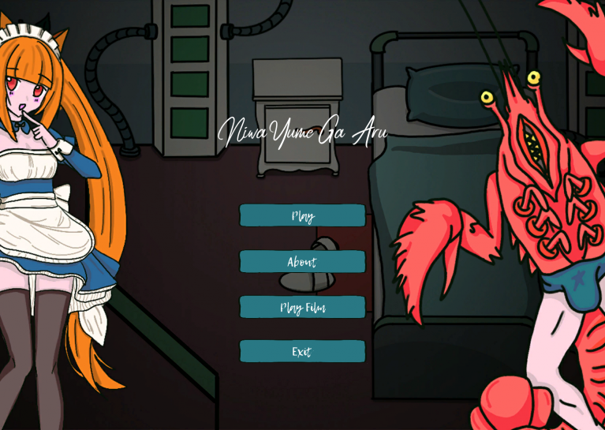
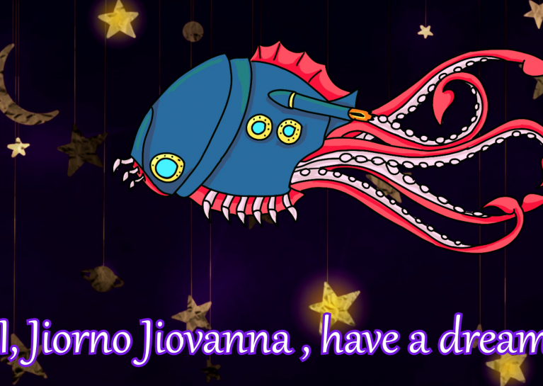
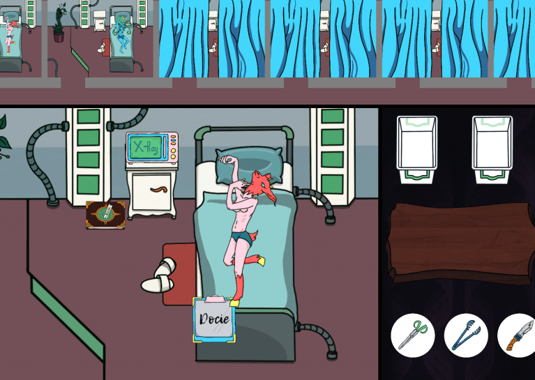
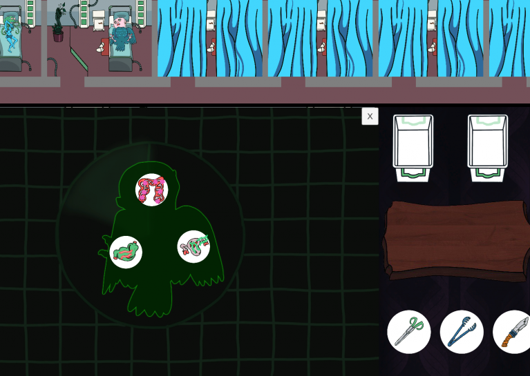
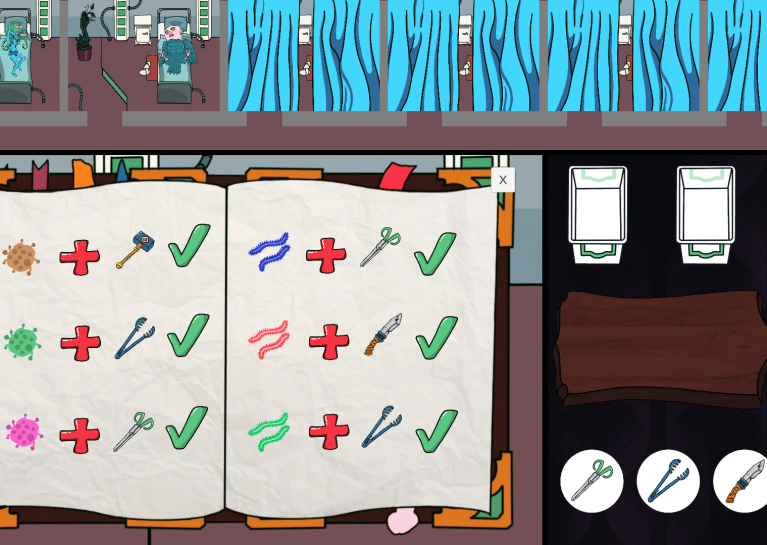

# [Global Game Jam 2020](https://globalgamejam.org/)
Theme: Repair  
Niwa Yume Ga Aru  
Game about young man pursuing his dream and fixing all around. And neko-girls of course.  
"I, Jiorno Jiovanna , have a dream. That one day I'll become mangaku. But my parents have other idea. They want me to become a doctor. Med school, internship, and now the most punishing practice on the MEDSHIP in the GALAXY FAR, FAR AWAY. But someday I gonna fix my spaceship and get out of here... I just need some money."

# Downloads and Links
Available in [Windows, Linux, OSX and Android](https://teamon.itch.io/niwa-yume-ga-aru). If you encounter any problem, please leave a issue! 

# Global Game Jam?
The Global Game Jam is the world's largest game jam event taking place around the world at physical locations. Think of it as a hackathon focused on game development. It is the growth of an idea that in today’s heavily connected world, we could come together, be creative, share experiences and express ourselves in a multitude of ways using video games – it is very universal. The weekend stirs a global creative buzz in games, while at the same time exploring the process of development, be it programming, iterative design, narrative exploration or artistic expression. It is all condensed into a 48 hour development cycle. The GGJ encourages people with all kinds of backgrounds to participate and contribute to this global spread of game development and creativity. [More here...](https://globalgamejam.org/about)

# Tools:
 * Unity 2019.2.5f1
 * Visual Studio 2019
 * Procreate
 * FlipaClip

# Credits
 * [Team-on](https://github.com/Team-on) - programmer
 * [Long-as-Python](https://github.com/Long-as-Python) - programmer
 * [mary.ggrusha](https://www.instagram.com/ggrusha_art/) - 2d artist
 * [shintaro-kk](https://www.instagram.com/shintaro_kk) - sound designer/narrative designer/game designer
 * [Trozeman](https://github.com/Trozeman) - programmer
 * [preasmh](https://www.instagram.com/preasmh/) - 2d artist
 

# Screenshots
  
  
  
 

